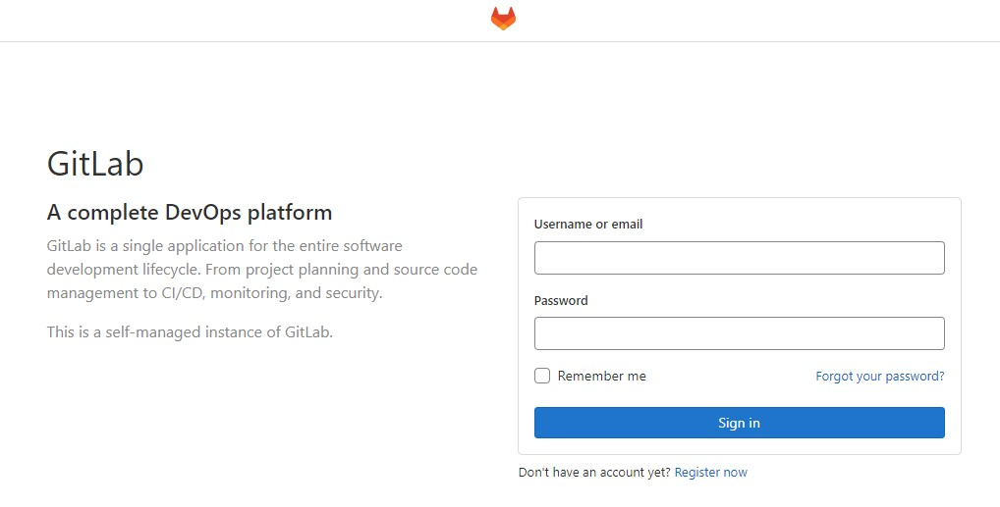

# preconfigured-gitlab

This repository creates preconfigured GitLab to download Your repos and run their CI/CD pipelines in EC2. 🔨

Create your GitLab server only when you need it and destroy it afterwards using simple Terraform commands! 💥
This will reduce your costs to minimum!

Use my init script and adapt them to your environment to quickly recreate a preconfigured GitLab for your own needs! Turn it on and off whenever your want. 😎


## Usage:

0. Install [AWS CLI](https://docs.aws.amazon.com/cli/latest/userguide/getting-started-install.html) and [Terraform](https://learn.hashicorp.com/tutorials/terraform/install-cli).

1. Create AWS access keys and export them:

```bash
$ export AWS_ACCESS_KEY_ID=AK************IEVXQ
$ export AWS_SECRET_ACCESS_KEY=gbaIbK*********************iwN0dGfS
```

, or configure a default AWS profile

```bash
aws configure --profile default
AWS Access Key ID [None]: AK************IEVXQ
AWS Secret Access Key [None]: gbaIbK*********************iwN0dGfS
Default region name [None]: eu-central-1
Default output format [None]: json
```

2. Create preconfigured-gitlab-key certificate key to be able to login using ssh

3. Execute:

```bash
cd infrastructure-terra
```

```bash
terraform init
```

, and then:

```bash
terraform apply
```

, confirm with 'yes' and enjoy your newly created AWS EC2 GitLab server ;) The IP will be randomly generated and printed in the console output.

```
       *.                  *.
      ***                 ***
     *****               *****
    .******             *******
    ********            ********
   ,,,,,,,,,***********,,,,,,,,,
  ,,,,,,,,,,,*********,,,,,,,,,,,
  .,,,,,,,,,,,*******,,,,,,,,,,,,
      ,,,,,,,,,*****,,,,,,,,,.
         ,,,,,,,****,,,,,,
            .,,,***,,,,
                ,*,.
     _______ __  __          __
    / ____(_) /_/ /   ____ _/ /_
   / / __/ / __/ /   / __ `/ __ \
  / /_/ / / /_/ /___/ /_/ / /_/ /
  \____/_/\__/_____/\__,_/_.___/


Thank you for installing GitLab!
GitLab should be available at http://<random-ip>/
```

4. To destroy you EC2 instance execute:

```bash
terraform destroy
```

... and type: 'yes'.

Deploy your GitLab instance only when needed to reduce the costs and destroy it afterwards ;)

So far this server is only created and doesn't include any ready to go pipelines or repos.



## Need further support?

Contact me if you need help at rojberr@outlook.com .

## Quick TODO list:

- use Amazon EC2 Spot Instances,
- adhere to Spot Instances best practices,
- automate with Kubernetes the deployment, management, and scaling of containers

- setting up the infra / server
- downloading gitlab or container hosted?
- installation / first setup
- unlocking gitlab for the first time (token?)
- user creation (at least one for each: guest / dev / admin) with roles
- gitlab master runners setup (one master and create at least one runner)
  (master - scheduling jobs, communicating and giving instr)
  (runner - execute jobs, takes cmds from master)
- configure global security for runners

- build pipelines (at least one for each project)
- schedule some nightly / periodic builds

- configure build triggers on git push
  (webhook and poll scm)

- delegate user database or include LDAP

- configure:
- set system message
- set # executors
- email notifications (use plugin extended e-mail notification)
- configure smtp (gmail? / docker mailserver)
-
- html reports after tests

- add .gitlab-ci.yml to each project

- pipelines to build docker image from Dockerfile and upload to Dockerhub

- multibranch jobs ?? like in jenkins?

- deploy with AWS marketplace image? and then edit /etc/gitlab/gitlab.rb ? sudo gitlab-ctl reconfigure